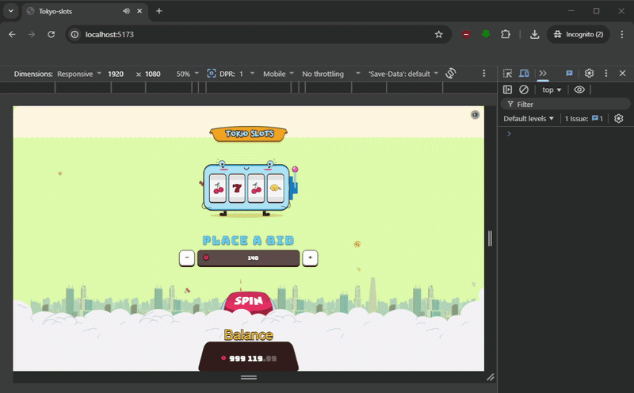

# 🎰 Tokyo Slots

A browser-based slot machine game built with React + TypeScript + Framer Motion.



---

## Tech Stack

- React 19 + Vite
- TypeScript (strict)
- Zustand — state management
- Framer Motion — animations
- Howler.js — sound
- CSS Modules

---

## Getting Started

**Requirements:** Node.js 18+

```bash
# Clone project
git clone https://github.com/MykytaMusaiev/tokyo-slots

# From downloaded folder - install dependencies
npm install

# Start dev server
npm run dev
```

Open [http://localhost:5173](http://localhost:5173) in your browser.

```bash
# Type check
npx tsc --noEmit

# Production build
npm run build
```

---

## Gameplay

- Choose your bet with **+/−** controls or type directly
- Spin via the **SPIN button** or pull the **lever**
- Match 3 or 4 symbols to win — match four **7s** for the **Jackpot**
- Balance is tracked across spins

---

## Project Structure

```
src/
├── shared/
│   ├── types/          # All TypeScript types and enums
│   ├── constants/      # Game constants, sound keys
│   ├── store/          # Zustand game store
│   ├── hooks/          # useGameLogic, useSound, useAnimatedNumber
│   ├── sounds/         # soundService (Howler)
│   └── utils/          # formatBalance
└── components/
    ├── Background/     # Static background, particles
    ├── CloudsOverlay/  # Fixed clouds layer (z-index above SpinButton)
    ├── TitlePlate/     # Game title
    ├── SlotMachine/    # Reels + lever
    ├── BetControls/    # Bet input with +/− buttons
    ├── SpinButton/     # Animated spin button
    ├── BalanceDisplay/ # Animated balance counter
    ├── ResultPopup/    # Win/Lose overlay with result
    └── MuteButton/     # Global mute toggle
```
